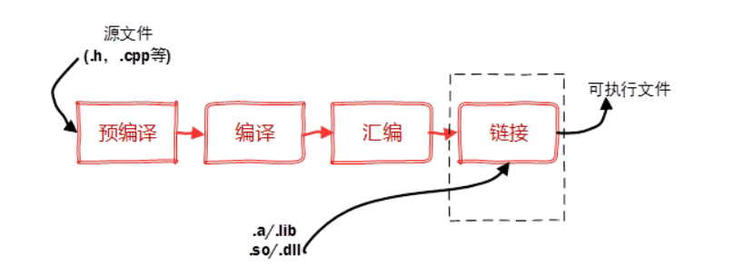

# 工作空间
## 功能包
### 功能包介绍
1. ROS2实现某种功能的基本单位被称为功能包（Package）。
2. 在物理层面上，功能包是一个文件夹，内含各种文件和文件夹，包括源码、编译文件、配置文件、资源文件等。
3. 在抽象层面上，功能包用于独立实现某种功能，源码中也可以引入其他功能包作为依赖项。功能包通常包含以下文件和文件夹：
   - `package.xml`：描述包的元数据，包括包名、版本、维护者、依赖项等。
   - `CMakeLists.txt`：用于定义如何构建包的CMake配置文件。
   - `src/`：存放源代码的目录。
   - `include/`：存放头文件的目录。
   - `launch/`：存放启动文件的目录。
   - `msg/`、`srv/`、`action/`：分别存放消息、服务和动作定义的目录（如果有的话）。
### 功能包创建指令
功能包的创建有两种方法：  
   1. 使用mkdir和touch命令，自己逐一创建。此方法较为繁琐
   2. 运行指令
   ```sh
   ros2 pkg create <package-name>  --build-type  {cmake,ament_cmake,ament_python}  --dependencies <依赖名字>
   ```
## 节点
在ROS2中，节点是最基本的计算单元，功能包的主要功能之一就是储存节点。例如对于导航功能而言，可以在一个实现导航功能的功能包中定义多个节点，每个节点各司其职，一个负责从雷达获取数据、一个负责从里程计中读取数据、一个负责整合里程计数据并定位、一个负责进行路径规划等等。ROS2为节点准备了4中通信方式，使得节点之间可以相互交流，我们将在之后的学习中再学习相关的内容。  
ros2的API文档：https://docs.ros2.org/latest/api/rclcpp/
   1. C++节点的依赖项：```#include "rclcpp/rclcpp.hpp"```
   2. ROS2中节点被定义在类内，公开继承自rclcpp::Node类
      ```cpp
      #include "rclcpp/rclcpp.hpp"

      class MyNode : public rclcpp::Node
      {
      public:
         MyNode() : Node("my_node")
         {
               RCLCPP_INFO(this->get_logger(), "Hello ROS2!");
         }
      };

      int main(int argc, char * argv[])
      {
         rclcpp::init(argc, argv);
         auto node = std::make_shared<MyNode>();
         rclcpp::spin(node);
         rclcpp::shutdown();
         return 0;
      }
      ```
   3. 源码编写好后需要进行编译，在编译前需要再CmakeLists.txt文件中检查编译信息收完善，并定义将指定cpp文件添加为一个可执行文件
      ```cmake
      add_executable(my_node src/example.cpp)
      ```
      1. 这行代码定义了一个可执行文件my_node，其源文件是src/example.cpp。
      2. 告诉CMake系统要编译src/example.cpp文件，并生成一个名为my_node的可执行文件。
      ```cmake
      ament_target_dependencies(my_node rclcpp)
      ```
      1. 这行代码指定了my_node的依赖项为rclcpp库。
      2. 告诉CMake系统在编译my_node时需要链接rclcpp库，这是ROS2的核心C++库，提供了节点、话题、服务等功能。
      ```cmake
      install(TARGETS my_node
               DESTINATION lib/${PROJECT_NAME})
      ```
      1. 这段代码定义了安装规则，将my_node可执行文件安装到lib/${PROJECT_NAME}目录下。
      2. 告诉CMake系统在执行colcon build时，将生成的my_node可执行文件复制到安装目录中，${PROJECT_NAME}是当前CMake项目的名称。

   4. 随后使用```colcon build```指令进行编译。  
      colcon build的作用:
         - 构建工作区：colcon build 会遍历工作区中的所有包，并根据它们的依赖关系顺序构建这些包。
         - 处理依赖关系：colcon 会自动处理包之间的依赖关系，确保在构建某个包之前，先构建它所依赖的包。
         - 生成构建工件：colcon build 会在工作区的install目录中生成构建工件（如可执行文件、库文件等）。  
         - 对于大型编译项目，可以使用多线程进行编译，加快编译效率
            ```bash
            <!-- N为线程数量 -->
            colcon build --parallel-workers N
            ```
   5. source install/setup.bash后，使用ros2 run pkg_name executable_name启动可执行文件
   6. 在终端输入```ros2 pkg prefix rclcpp```可以定位rclcpp头文件的位置，感兴趣的同学可以自行查看其中的架构，由于过于繁琐复杂，我们会在夏令营结束后备赛期间组织大家一起学习，非本次夏令营需要掌握。
## 编译相关
程序编译一般需要经**预处理**、**编译**、**汇编**和**链接**几个步骤。在实际应用中，有些公共代码需要反复使用，就把这些代码编译成为“库”文件。在链接步骤中，链接器将从库文件取得所需的代码，复制到生成的可执行文件中，这种库称为静态（链接）库，其特点是可执行文件中包含了库代码的一份完整拷贝，缺点是被多次使用就会多份冗余拷贝。还有一种库，就是程序在开始运行后调用库函数时才被载入，这种库独立于现有的程序，其本身不可执行，但包含着程序需要调用的一些函数，这种库称为动态（链接）库（Dynamic Link Library）。  
在widows平台下，静态链接库是.lib文件，动态库文件是.dll文件。在linux平台下，静态链接库是.a文件，动态链接库是.so文件。



## CmakeLists.txt文件的一般架构
1. 项目声明和版本设置
首先，你需要定义所需的CMake最低版本和定义项目的名称
   ```cmake
   cmake_minimum_required(VERSION 3.5)
   project(my_ros2_package)
   ```
2. 找到依赖项
使用find_package()命令来寻找ROS 2和其他库的依赖项。例如，如果你要使用rclcpp和std_msgs：
   ```cmake
   find_package(ament_cmake REQUIRED)
   find_package(rclcpp REQUIRED)
   find_package(std_msgs REQUIRED)
   ```
find_package找到的依赖项是供给CmakeLists的。
3. 添加编译选项（可选）
你可以添加编译选项，如C++标准版本：
   ```cmake
   add_compile_options(-std=c++17)
   ```
4. 添加头文件目录（可选）
如果有自定义的头文件，可以指定包含目录：
   ```cmake
   include_directories(include)
   ```
   也可以使用更推荐的
   ```cmake
   target_include_directories(my_node PUBLIC
   $<BUILD_INTERFACE:${CMAKE_CURRENT_SOURCE_DIR}/include>
   $<INSTALL_INTERFACE:include>)
   ```
   来指定头文件目录

5. 添加源文件
使用add_executable()命令添加可执行文件，并指定源文件：
   ```cmake
   add_executable(my_node src/my_node.cpp)
   ```
6. 链接库
为可执行文件链接ROS 2的依赖库：
   ```cmake
   ament_target_dependencies(my_node rclcpp std_msgs)
   ```
在**2. 找到依赖项**中已经找到了rclcpp和std_msgs,因此可以直接将其连接到my_node可执行文件中
7. 安装规则
指定生成的可执行文件和其他文件的安装位置：
   ```cmake
   install(TARGETS
   my_node
   DESTINATION lib/${PROJECT_NAME}
   )
   ```
   如果有多个可执行文件，或者需要安装其他类型的文件（如配置文件、launch文件），可以扩展install()命令。例如：
   ```cmake
   install(DIRECTORY launch/
   DESTINATION share/${PROJECT_NAME}/launch)
   ```
   这会将launch/目录中的文件安装到${PROJECT_NAME}下的share目录中。
8. 启用测试（可选）
如果有测试代码，启用并配置测试：
   ```cmake
   if(BUILD_TESTING)
   find_package(ament_lint_auto REQUIRED)
   ament_lint_auto_find_test_dependencies()
   endif()
   ```
9. 调用ament_package()
最后一步，调用ament_package()，以便ament工具处理包的安装、依赖解析等工作：
   ```cmake
   ament_package()
   ```
# 任务
- 构建一个功能包， 在终端打印信息："hello, ros2, i am {}"
- 修改源码，引入新的依赖项并重构代码，体验cmakeLists和package.xml的改写  
示例：
   ```cpp
   #include "rclcpp/rclcpp.hpp"
   #include "std_msgs/msg/int32.hpp"
   #include "std_msgs/msg/string.hpp"
   class MyNode : public rclcpp::Node
   {
   public:
      MyNode() : Node("my_node")
      {
            auto x = std::make_shared<std_msgs::msg::Int32>();
            x->data = 1;
            RCLCPP_INFO(this->get_logger(), "Hello RCS! %d", x->data);
      }

   };

   int main(int argc, char * argv[])
   {
      rclcpp::init(argc, argv);
      auto node = std::make_shared<MyNode>();
      rclcpp::spin(node);
      rclcpp::shutdown();
      return 0;
   }

- 尝试自己从0开始书写CmakeLists.txt文件，