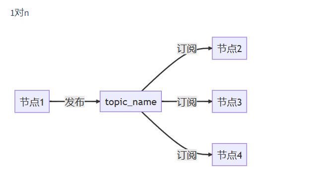
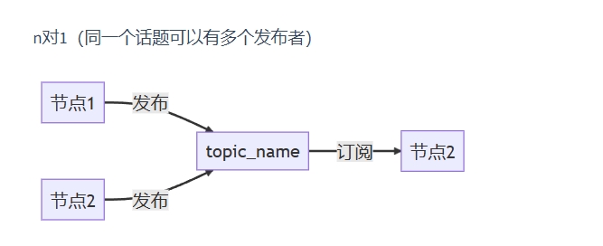
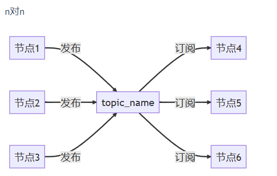
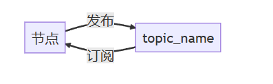
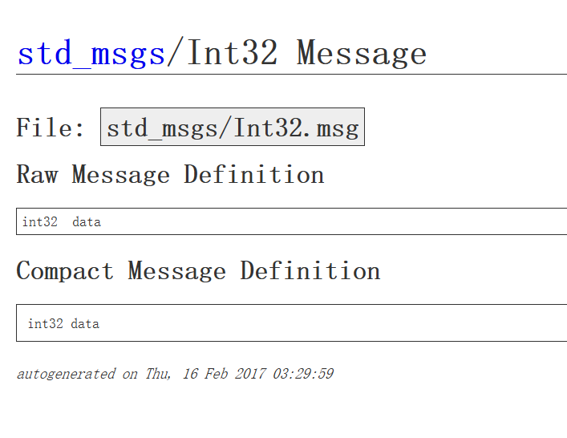
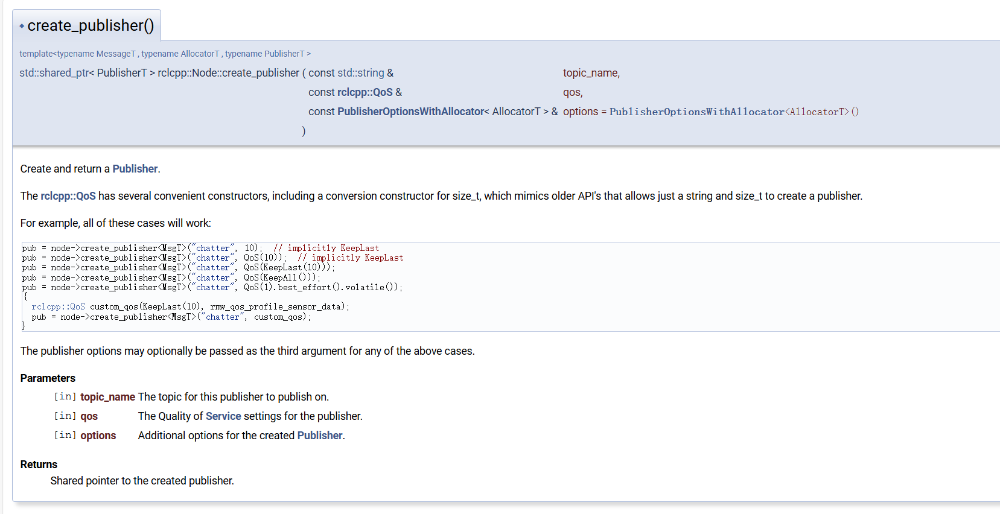
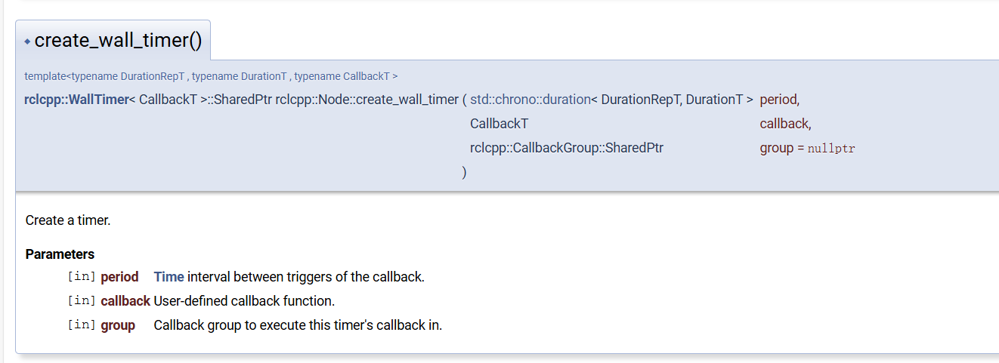
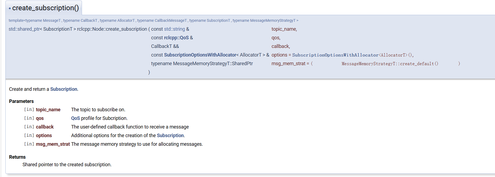

# 话题
话题是ROS2中最常用的通信方式之一，话题通信采取的是订阅发布模型。
## 订阅发布模型
1. 一个节点发布数据到某个话题上，另外一个节点就可以通过订阅话题拿到数据

2. 除了上述这种一个节点发布，一个节点接受的形式外，ROS2话题通信还可以是1对n,n对1,n对n的。



3. ROS2节点可以订阅本身发布的话题

4. 消息的订阅者和发布者必须使用相同的消息接口
## 消息接口
ROS2是跨平台、跨语言、跨设备的，因此其有一套自己的消息接口，其含义类似于C++的结构体数据，包含数据信息,有时还会包含头信息等，用于标准化与序列化数据。  
在chapter2的作业中，我们引入了```std_msgs/msg/int32.hpp```头文件，搜索该消息类型的定义，如图

### 消息的命名规范
1. 消息名称必须以大写字母开头。
2. 消息名称只能包含字母和数字，不能包含其他字符（如空格、下划线等）。
需要注意的是：
.msg文件由rosidl_default_generatos工具生成对应的C++头文件，而C++头文件约定使用小写，并且可以包含下划线。因此，.msg的文件名和生成的C++头文件名不同。我们在上面引入了int32.hpp头文件，其中的int32首字母为小写，便是因此。  
例如：
自定义消息类型：```MyCustomMessage```  
生成的c++头文件为```my_custom_message.hpp```  
即**生成规则**为：将大写全部转换为小写，并且在非字母的大写字母前加一个下划线
### 指定消息类型的创建与赋值
1. 数据形式：
```cpp
auto message = std_msgs::msg::String();
x.data = "hello, RCS!"
```
2. 指针形式：
```cpp
auto x = std::make_shared<std_msgs::msg::Int32>();
x->data = "hello, RCS!"
```
3. std::make_shared用于创建一个共享指针，其相对于使用new等方法创建的指针更加高效与安全。
### 自定义消息类型的创建
1. 在功能包中创建msg文件夹
2. 创建MsgName.msg文件
3. 如若创建鱼消息类型，则应包含鱼的种类和鱼的重量,并将文件命名为Fish.msg
    ```go
    std_msgs/Int32 heavy
    std_msgs/String fishtype
    ```
    其中，std_msgs为Int32和String的消息依赖包。若为float32、unit32等c++自己的数据类型，则不需要添加依赖包
4. 修改CmakeLists.txt和package.xml文件
    1. CmakeLists文件：
    ```cmake
    find_package(rosidl_default_generators REQUIRED)
    find_package(std_msgs)

    rosidl_generate_interfaces(${PROJECT_NAME}
    "msg/Fish.msg"
    DEPENDENCIES std_msgs
    )

    ament_export_dependencies(rosidl_default_runtime)
    ```
    - rosidl_default_generators包包含了ROS 2的IDL（Interface Definition Language）接口生成工具。这些工具用于根据.msg、.srv、和.action文件生成对应的C++、Python等语言的代码，从而让自定义消息、服务和动作能够在你的节点中使用。
    - rosidl_default_runtime 是一个包含ROS 2运行时库的包，这些库支持自定义消息、服务和动作的运行时功能。它包括了消息序列化、反序列化等功能的运行时支持。
5. 在 package.xml 中，添加对 rosidl_default_generators和std_msgs的依赖，并标记当前包属于rosidl_interface_packages组：
    ```xml
    <depend>rosidl_default_generators</depend>
    <depend>std_msgs</depend>

    <member_of_group>rosidl_interface_packages</member_of_group>
    ```
6. 使用```colcon build --packages-select <name-of-pkg>```单独编译工作空间内的包  
## 话题发布者
### 发布者创建
查找有关发布者的API：

1. 函数定义:
    ```cpp
    template<typename MessageT , typename AllocatorT , typename PublisherT>
    std::shared_ptr<PublisherT> rclcpp::Node::create_publisher(
        // 话题名称
        const std::string & topic_name,
        // 发布者的服务质量设置：如保留最后N条信息、保留所有信息等
        const rclcpp::QoS & qos,
        // 指定创建发布者的额外选项，可以不指定（此时使用默认）
        const PublisherOptionsWithAllocator<AllocatorT> & options = PublisherOptionsWithAllocator<AllocatorT>()
    )
    ```
2. 
    - **MessageT**是显式指定的。为消息类型
    - **AllocatorT**无需指定。为内存分配器的类型。通常情况下，用户不会改变内存分配器的类型，而是使用默认的标准分配器 std::allocator<void>。```PublisherOptionsWithAllocator<AllocatorT>```是一个模板类，其中便指定了AllocatorT的默认类型
    - **PublisherT** 是具体的发布者类型，基于 MessageT 和 AllocatorT 的组合，以及其他相关的内部逻辑，由 create_publisher 函数**模板**的实现自动推导出来。（在代码的实现和调用过程中，并没有显式提到 PublisherT 是如何推导的。这是因为 PublisherT 的推导行为发生在模板的实现部分，而不是在模板声明或调用时直接可见。）
3. 返回一个```std::shared_ptr<PublisherT>```类型的指针。
### 创建示例
- 使用默认的 KeepLast 策略，最多保留 10 条消息：
    ```cpp
    auto pub = node->create_publisher<MsgT>("topic_name", 10);
    ```
- 显式地创建 QoS 对象，并传入 KeepLast 策略：
    ```cpp
    auto pub = node->create_publisher<MsgT>("topic_name", rclcpp::QoS(10));
    ```
- 使用 KeepAll 策略，保留所有消息：
    ```cpp
    auto pub = node->create_publisher<MsgT>("topic_name", rclcpp::QoS(rclcpp::KeepAll()));
    ``` 
- 自定义 QoS 设置，例如使用 BestEffort 和 Volatile 策略：
    ```cpp
    复制代码
    auto pub = node->create_publisher<MsgT>("topic_name", rclcpp::QoS(1).best_effort().volatile());
    ```
- 结合多个 QoS 设置，如传感器数据的 QoS 设置：
    ```cpp
    rclcpp::QoS custom_qos(rclcpp::KeepLast(10), rmw_qos_profile_sensor_data);
    auto pub = node->create_publisher<MsgT>("topic_name", custom_qos);
    ```
### 定时器
创建好发布者后，我们需要发布数据。我们需要通过ROS2中的定时器来设置指定的周期调用回调函数，在回调函数里实现发布数据功能。  
我们查看前往官网API网站，查找Timer类中的create_wall_timer()函数

其函数原型为：
```cpp
template<typename DurationRepT , typename DurationT , typename CallbackT >
rclcpp::WallTimer< CallbackT >::SharedPtr rclcpp::Node::create_wall_timer	(	std::chrono::duration< DurationRepT, DurationT > 	period,
CallbackT 	callback,
rclcpp::CallbackGroup::SharedPtr 	group = nullptr 
)	
```
1. 模板参数解释
    - DurationRepT：
        代表时间间隔（周期）的基数类型。
        这是一个整数或浮点数类型，表示时间的“数值部分”。
        例如，int、long、float 都可以作为 DurationRepT。
    - DurationT：
        代表时间间隔（周期）的单位类型。
        这是一个时间单位类型，如 std::chrono::seconds、std::chrono::milliseconds 等。
        它定义了 DurationRepT 的单位，使得定时器的周期可以是秒、毫秒、微秒等。
    - CallbackT：
        代表回调函数的类型。
        回调函数将在定时器触发时执行，可以是一个函数指针、函数对象或 lambda 表达式。
2. 函数参数解释
    - period（时间间隔）：
        类型：```std::chrono::duration<DurationRepT, DurationT>```
        该参数指定了定时器的触发周期，即每隔多长时间触发一次回调。
        例如，std::chrono::seconds(1) 表示每秒触发一次回调，std::chrono::milliseconds(500) 表示每 500 毫秒触发一次回调。
    - callback（回调函数）：
        类型：```CallbackT```
        用户定义的回调函数，当定时器触发时执行的操作。
        这个回调函数可以是一个普通函数、函数对象或 lambda 表达式。
    - group（回调组，默认参数）：
        类型：```rclcpp::CallbackGroup::SharedPtr```
        这是一个可选参数，表示定时器的回调执行所在的回调组。如果为 nullptr，则使用默认的回调组。
        回调组允许用户组织和管理不同的回调，使得它们在特定的执行上下文中运行。
    - 返回值
    SharedPtr<rclcpp::WallTimer<CallbackT>>：返回一个共享指针，指向创建的定时器对象。这个对象会自动管理定时器的生命周期。
### 示例代码
```cpp
#include <rclcpp/rclcpp.hpp>
#include <mymessage/msg/fish.hpp>

class TopicPublisher01 : public rclcpp::Node
{
public:
    // 构造函数,有一个参数为节点名称
    TopicPublisher01(std::string name) : Node(name)
    {
        RCLCPP_INFO(this->get_logger(), "大家好，我是%s.", name.c_str());
        // 创建发布者
        command_publisher_ = this->create_publisher<mymessage::msg::Fish>("command", 10);
        // 创建定时器，500ms为周期，定时发布
        timer_ = this->create_wall_timer(std::chrono::milliseconds(500), std::bind(&TopicPublisher01::timer_callback, this));
    }

private:
    void timer_callback()
    {
        // 创建消息
        mymessage::msg::Fish message;
        message.heavy.data = 30;
        message.fishtype.data = "cao";
        // 日志打印
        RCLCPP_INFO(this->get_logger(), "钓鱼佬永不空军! 看我钓了个啥: '%d', '%s'", message.heavy.data, message.fishtype.data.c_str());
        // 发布消息
        command_publisher_->publish(message);
    }
    // 声名定时器指针
    rclcpp::TimerBase::SharedPtr timer_;
    // 声明话题发布者指针
    rclcpp::Publisher<mymessage::msg::Fish>::SharedPtr command_publisher_;
};

int main(int argc, char * argv[])
{
    rclcpp::init(argc, argv);
    rclcpp::spin(std::make_shared<TopicPublisher01>("Minihill"));
    rclcpp::shutdown();
    return 0;
}
```
运行发布者代码，在终端输入ros2 topic list可以查看正在运行的话题名称  
输入ros2 topic echo <topic_name>可以查看对应话题的消息(若存在自定义消息，需要先source一下)
## 话题订阅者
查看订阅者的API文档：

1. 模板参数解释
    - MessageT:
    订阅的消息类型，例如 std_msgs::msg::String、geometry_msgs::msg::Pose 等。这定义了订阅者期望从指定主题接收的消息类型。
    - CallbackT:
    回调函数的类型，当订阅者接收到消息时会调用这个函数。它通常是一个函数指针、std::function 或者 lambda 函数。
    - AllocatorT:
    用于消息分配的内存分配器类型。默认为 std::allocator<void>。通过指定自定义的分配器，你可以控制内存的分配和释放行为。
    - CallbackMessageT:
    实际传递给回调函数的消息类型。通常与 MessageT 相同，但在某些高级场景下可能不同。
    - SubscriptionT:
    订阅者的类型。通常为 rclcpp::Subscription<MessageT>。这个类型会根据消息类型MessageT和其他模板参数来确定。
    - MessageMemoryStrategyT:
    管理消息内存分配的策略类型。ROS 2 允许自定义内存管理策略，默认为 rclcpp::message_memory_strategy::MessageMemoryStrategy<MessageT>。
2. 函数参数
    - topic_name (const std::string &):
    要订阅的主题名称。订阅者将从这个主题接收消息。
    - qos (const rclcpp::QoS &):
    QoS（Quality of Service）配置
    - callback (CallbackT &&):
    用户定义的回调函数，当订阅者接收到消息时调用。回调函数的签名通常类似于 void callback(const std::shared_ptr<MessageT> msg)。
    - options (const SubscriptionOptionsWithAllocator<AllocatorT> &):
    创建订阅者时的额外选项。SubscriptionOptionsWithAllocator允许指定自定义的分配器、回调组等。默认情况下，使用默认选项。
    msg_mem_strat (typename MessageMemoryStrategyT::SharedPtr):
    - 管理消息分配的内存策略。默认为 MessageMemoryStrategyT::create_default()。该策略控制如何为接收到的消息分配内存。
    - 返回值
    ```std::shared_ptr<SubscriptionT>```
    返回一个共享指针，指向创建的订阅者。这个指针可以用来管理订阅者的生命周期。
### 示例代码
```cpp
#include "rclcpp/rclcpp.hpp"
#include <mymessage/msg/fish.hpp>

class TopicSubscribe01 : public rclcpp::Node
{
public:
    TopicSubscribe01(std::string name) : Node(name)
    {
        RCLCPP_INFO(this->get_logger(), "大家好，我是%s.", name.c_str());
          // 创建一个订阅者订阅话题
        command_subscribe_ = this->create_subscription<mymessage::msg::Fish>("command", 10, std::bind(&TopicSubscribe01::command_callback, this, std::placeholders::_1));
    }

private:
     // 声明一个订阅者
    rclcpp::Subscription<mymessage::msg::Fish>::SharedPtr command_subscribe_;
     // 收到话题数据的回调函数
    void command_callback(const mymessage::msg::Fish::SharedPtr msg)
    {
        RCLCPP_INFO(this->get_logger(), "钓上[%s]鱼, 重 %d", msg->fishtype.data.c_str(), msg->heavy.data);
    }
};

int main(int argc, char * argv[])
{
    rclcpp::init(argc, argv);
    rclcpp::spin(std::make_shared<TopicSubscribe01>("Ilidan"));
    rclcpp::shutdown();
    return 0;
}
```
别忘了修改Cmake和xml文件。
# 任务
- 自定义一个机器人移动消息，包含机器人的三维坐标和三维速度
- 编写并编译一个发布者节点，能够发布机器人的坐标和速度信息，坐标能够根据速度随时间改变，并通过终端检查是否成功发送
- 编写并编译一个订阅者节点，能够订阅上述发布的机器人坐标和速度信息，并打印根据订阅信息打印位姿

