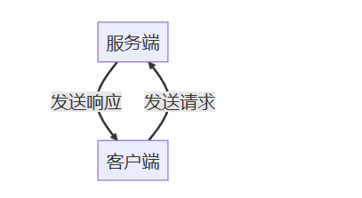

# 服务
服务分为客户端和服务端。客户端发送请求给服务端，服务端可以根据客户端的请求做一些处理，然后返回结果给客户端。

- 同一个服务（名称相同）有且只能有一个节点来提供
- 同一个服务可以被多个客户端调用

## 服务消息接口
### 接口架构
储存在功能包的srv文件夹下，对应的消息文件后缀为.srv
### 接口格式
服务的消息接口分为两部分，如
```go
int64 a
int64 b
---
int64 sum
```
其中a、b为客户端发送给服务器的消息类型，称为请求部分；sum为服务器返回给客户端的消息类型，称为响应部分.
### 编译信息
Cmake和xml文件如.msg，仅需修改文件夹和文件后缀即可

## 服务端