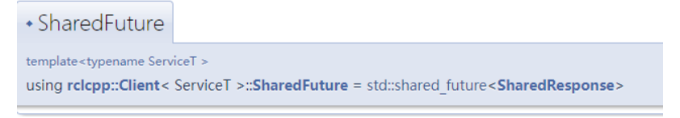

# 服务
服务分为客户端和服务端。客户端发送请求给服务端，服务端可以根据客户端的请求做一些处理，然后返回结果给客户端。

- 同一个服务（名称相同）有且只能有一个节点来提供
- 同一个服务可以被多个客户端调用

## 服务消息接口
### 接口架构
储存在功能包的srv文件夹下，对应的消息文件后缀为.srv
### 接口格式
服务的消息接口分为两部分，如
```go
int64 a
int64 b
---
int64 sum
```
其中a、b为客户端发送给服务器的消息类型，；sum为服务器返回给客户端的消息类型.  
最终生成的结构体有两个成员：Request、Response  
Request含有两个成员：a、b  
Response含有一个成员:sum  

### 编译信息
Cmake和xml文件如.msg，仅需修改文件夹和文件后缀即可

## 服务端
### 查看服务创建的API

1. 模板参数解释：
    - ServiceT
    这个模板参数指定了服务的类型。服务类型通常是由 ROS 2 中的服务接口生成的。ServiceT 定义了服务请求和响应的结构。
    - CallbackT
    这个模板参数指定了用户定义的回调函数的类型。回调函数是当服务被调用时执行的函数。通常，回调函数的类型是一个函数对象或 lambda 表达式，它接受一个请求类型的共享指针和一个响应类型的共享指针。
2. 函数参数解释：
    - service_name (const std::string &):
    这是服务的名称。在 ROS 2 中，服务的名称类似于一个话题名称，用于标识服务。客户端通过服务名称来调用服务。因此，service_name 是一个字符串，用于指定服务的标识符，例如 "add_two_ints"。
    - callback (CallbackT &&):
    这是用户定义的回调函数，它将在服务被调用时执行。该回调函数的形式通常是一个函数对象或 lambda 表达式，并接受请求和响应作为参数。回调函数的类型由模板参数 CallbackT 指定。
    - qos_profile (const rmw_qos_profile_t &):
    这是质量服务（QoS）的配置参数，默认为 rmw_qos_profile_services_default。QoS 配置指定了服务的可靠性、持久性和其他通讯质量特性。例如，你可以配置 QoS 以确保服务请求和响应的可靠传递。ROS 2 提供了一些默认的 QoS 配置，例如 rmw_qos_profile_services_default。
    - group (rclcpp::CallbackGroup::SharedPtr = nullptr):
    这是一个可选参数，表示回调组（Callback Group）。回调组用于控制节点中的回调的执行方式，特别是在多线程情况下。默认值为 nullptr，表示使用默认的回调组。通过指定回调组，你可以定义回调的并发执行模型（例如，单线程执行或多线程执行）
### 示例代码
```cpp
#include "mymessage/srv/sum.hpp"
#include "rclcpp/rclcpp.hpp"

class ServiceServer01 : public rclcpp::Node 
{
    public:
    ServiceServer01(std::string name) : Node(name) 
    {
        RCLCPP_INFO(this->get_logger(), "节点已启动：%s.", name.c_str());
        // 创建服务
        // std::placeholders::_1, std::placeholders::_2为占位符，表示绑定函数的两个参数（请求、响应）
        add_ints_server_ =
        this->create_service<mymessage::srv::Sum>(
            "add_two_ints_srv",
            std::bind(&ServiceServer01::handle_add_two_ints, this,
                    std::placeholders::_1, std::placeholders::_2));
    }

    private:
    // 收到请求的处理函数
    void handle_add_two_ints(
        const std::shared_ptr<mymessage::srv::Sum::Request> request,
        std::shared_ptr<mymessage::srv::Sum::Response> response) 
        {
            RCLCPP_INFO(this->get_logger(), "收到a: %ld b: %ld", request->a,request->b);
            response->sum = request->a + request->b;
        };
    // 声明服务
    rclcpp::Service<mymessage::srv::Sum>::SharedPtr add_ints_server_;
};


int main(int argc, char * argv[])
{
    rclcpp::init(argc, argv);
    rclcpp::spin(std::make_shared<ServiceServer01>("Tyrant"));
    rclcpp::shutdown();
    return 0;
}
```
使用ros2 service list查看服务列表  
使用ros2 service call srv_name srv_message "{a: 5,b: 10}"调用服务进行a+b


## 客户端
### 查看API

1. 模板参数解释：
    - ServiceT:
    这个模板参数指定了服务的类型。服务类型通常由 ROS 2 中的服务接口定义，并由 srv 文件生成。ServiceT 定义了服务请求和响应的结构。例如，如果你使用的是一个名为 AddTwoInts 的服务，那么 ServiceT 应该是 example_interfaces::srv::AddTwoInts。这个参数用于告诉客户端它所要请求的服务类型。
2. 函数参数解释：
    - service_name (const std::string &):
    这是服务的名称。在 ROS 2 中，服务名称用于标识服务。客户端通过服务名称来请求特定的服务。因此，service_name 是一个字符串，用于指定客户端要连接的服务的标识符。例如 "add_two_ints"。

    - qos_profile (const rmw_qos_profile_t &):
    这是质量服务（QoS）的配置参数，默认为 rmw_qos_profile_services_default。QoS 配置指定了服务通信的可靠性、持久性和其他特性。QoS 配置可以确保服务请求和响应的传递符合应用的需求，例如设定可靠的传输、数据持久性等。ROS 2 提供了一些默认的 QoS 配置，比如 rmw_qos_profile_services_default，用于大多数标准应用场景。

    - group (rclcpp::CallbackGroup::SharedPtr = nullptr):
    这是一个可选参数，表示回调组（Callback Group）。回调组用于控制节点中的回调函数的执行方式，特别是在多线程环境下。默认值为 nullptr，表示使用节点的默认回调组。通过指定回调组，你可以定义回调函数的并发执行模型（例如，单线程执行或多线程执行）。
### 发送请求
查看API

async：异步  
1. 模板参数
    - ServiceT:
    这个模板参数指定了服务的类型。服务类型通常由 ROS 2 中的服务接口定义，并由 .srv 文件生成。ServiceT 定义了服务请求和响应的结构。例如，如果你使用的是一个名为 AddTwoInts 的服务，那么 ServiceT 就应该是 example_interfaces::srv::AddTwoInts。这个参数用于告诉客户端它要请求的服务类型。

    - CallbackT:
    这个模板参数指定了用户定义的回调函数的类型。回调函数是当服务响应返回时要执行的函数。CallbackT 的类型通常是一个函数对象或 lambda 表达式。CallbackT 的类型必须与 CallbackType 的参数类型相同，std::enable_if 用于在编译期间检查这一点。rclcpp::function_traits::same_arguments 是一个类型检查工具，用于确保 CallbackT 的参数类型与预期的 CallbackType 参数类型匹配。
2. 函数参数
    - request (SharedRequest):
    这是一个共享指针，指向服务请求对象。请求对象的类型由 ServiceT 决定，例如，example_interfaces::srv::AddTwoInts::Request。在请求对象中，用户可以设置服务请求所需的参数，例如两个整数的值 a 和 b。

    - cb (CallbackT &&):
    这是一个用户定义的回调函数，当服务请求的响应返回时将执行该函数。回调函数的类型由 CallbackT 确定，并且通常是一个 lambda 表达式或一个函数对象。这个回调函数的签名应与 ServiceT::Response 类型相匹配，因为它会接收到服务响应。例如，如果服务是 AddTwoInts，那么回调函数将会收到一个指向 example_interfaces::srv::AddTwoInts::Response 的共享指针。
3. 返回值
    - SharedFuture:
    该函数返回一个 SharedFuture 对象，这个对象表示一个异步操作的未来结果（future result）。用户可以使用 SharedFuture 来等待异步操作的完成或者获取异步操作的结果。
### 等待服务上线
发送请求给服务，因此在客户端发送请求之前，需要确保服务已经上线。使用```wait_for_service```等待服务上线

参数就一个，等待的时间，返回值是bool类型的，上线了就是true，不上线就是false。
### 示例代码
```cpp
#include "mymessage/srv/sum.hpp"
#include "rclcpp/rclcpp.hpp"

class ServiceClient01 : public rclcpp::Node 
{
public:
  // 构造函数,有一个参数为节点名称
  ServiceClient01(std::string name) : Node(name) 
  {
    RCLCPP_INFO(this->get_logger(), "节点已启动：%s.", name.c_str());
    // 创建客户端
    client_ = this->create_client<mymessage::srv::Sum>("add_two_ints_srv");
  }

  void send_request(int a, int b) 
  {
    RCLCPP_INFO(this->get_logger(), "计算%d+%d", a, b);

    // 1.等待服务端上线
    while (!client_->wait_for_service(std::chrono::seconds(1))) 
    {
      //等待时检测rclcpp的状态
      if (!rclcpp::ok()) 
      {
        RCLCPP_ERROR(this->get_logger(), "等待服务的过程中被打断...");
        return;
      }
      RCLCPP_INFO(this->get_logger(), "等待服务端上线中");
    }

    // 2.构造请求
    auto request = std::make_shared<mymessage::srv::Sum::Request>();
    request->a = a;
    request->b = b;

    // 3.发送异步请求，然后等待返回，返回时调用回调函数
    client_->async_send_request(
      request, std::bind(&ServiceClient01::result_callback_, this,
                         std::placeholders::_1));
  };

private:
  void result_callback_(rclcpp::Client<mymessage::srv::Sum>::SharedFuture result_future) 
    {
        auto response = result_future.get();
        RCLCPP_INFO(this->get_logger(), "计算结果：%ld", response->sum);
    }
    // 声明客户端
  rclcpp::Client<mymessage::srv::Sum>::SharedPtr client_;
};


int main(int argc, char** argv)
{
  rclcpp::init(argc, argv);
  /*创建对应节点的共享指针对象*/
  auto node = std::make_shared<ServiceClient01>("service_client_01");
  /* 运行节点，并检测退出信号*/
  //增加这一行，node->send_request(5, 6);，计算5+6结果
  node->send_request(5, 6);
  rclcpp::spin(node);
  rclcpp::shutdown();
  return 0;
}
```
对于回调函数``` void result_callback_```,函数的参数是客户端Sum类型的SharedFuture对象,其定义如下

可以看到其是利用=std::shared_future创建的SharedResponse类模板。  

类模板 std::shared_future 提供访问异步操作结果的机制，类似 std::future ，除了允许多个线程等候同一共享状态。

因此使用get获取结果

# 任务
- 书写一个服务端，接收机器人当前的位置和机器人目标位置，返回两个位置的距离
- 书写一个客户端，发送机器人当前位置和机器人目标位置
- 将服务端和客户端使用launch启动管理文件一键启动，客户端的机器人当前位置和目标位置由launch文件给出
