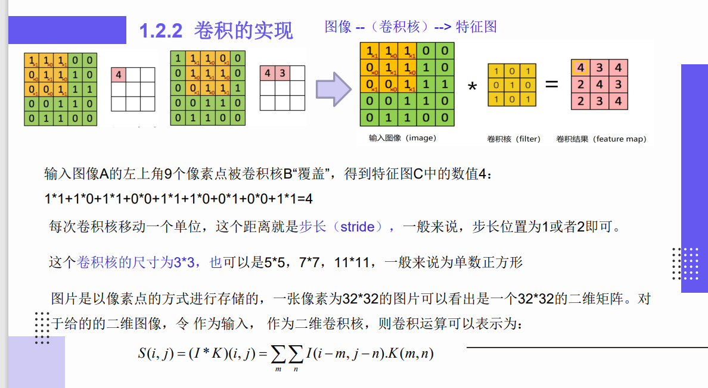
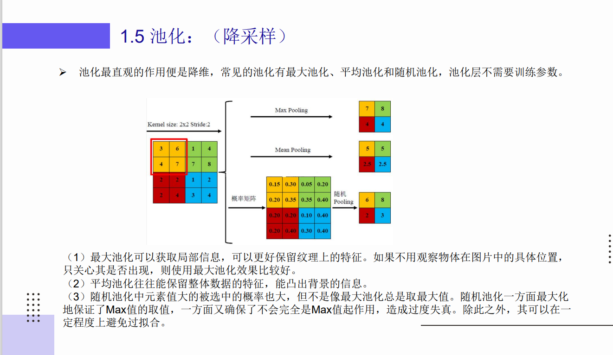

# 数学意义上的卷积操作
$$
y = \int f(x)*g(n-x)dx
$$
1. y为f(x)和g(x)的卷积结果
2. 数学含义：f(x)，g(x)均为一个序列，将g(x)翻转(-x)、平移(+n)，随后与f(x)进行叠加得到卷积结果。即用于表征函数f与g经过翻转和平移的重叠部分函数值乘积对重叠长度的积分

# 卷积神经网络的组成
## 卷积神经网络的卷积操作
1. 卷积神经网络中的卷积操作并非严格意义上的卷积操作，而是简化过的卷积操作，即
$$
y = \int f(x)g(x)dx
$$
2. 即直接计算两个序列重叠部分对重叠长度的积分
3. 卷积核就是权重矩阵

## 特征提取层
1. 操作：使用一个n*n的卷积核(一般为3x3)，对输入进行卷积，从而提取出局部特征。若卷积核的深度不为1，依然将所有局部特征加权求和，得到深度为1的图像。x个卷积核得到的输出图像深度为x 
2. 含义：将某个局部特征与一个神经元关联起来

3. 包含有  
    1. 卷积层：这是特征提取层的主要组成部分。卷积层通过在输入数据上滑动小的窗口（也称为卷积核或滤波器）来工作，这个过程可以提取出输入数据的局部特征。
    2. 激活层：在卷积层之后通常会有一个激活层，例如ReLU激活函数，用于增加网络的非线性。
    3. 池化层（也被称为下采样层）：池化层通常在卷积层和激活层之后，用于降低数据的维度，同时保留最重要的信息。常见的池化操作包括最大池化和平均池化
4. 对于池化操作：对局部区域进行池化提取，包含有最大池化（选取最大值）、平均池化（选取平均值）、概率池化（将数所占区域数和的比例作为概率，按概率随机选取）。

## 特征映射层
1. 该层所有神经元权值相等，即输入数据的所有局部特征的地位相同
2. 该层具有偏置相等：偏置用于过滤特征，即输入数据所有局部特征进行等价的过滤，满足条件的部分对应的神经元才会被激活。以图像检测为例，所有与目标图像相似度低于阈值的局部特征所对应的神经元都不被激活。
3. 包含有：
    1. 全连接层（Fully Connected Layer）：全连接层通常在一系列的卷积层和池化层（即特征提取层）之后，用于将提取的特征映射到目标类别。全连接层的每个神经元都与前一层的所有神经元相连，因此被称为“全连接”。
        1. 若全连接前面是池化层，则直接先将池化层展平，即将池化层矩阵按行优先排列成一维序列,然后对这个一维序列做出线性变换，最后通过激活函数引入非线性后传入全连接层；
        2. 若前面是全连接层，进行线性变换和非线性激活。两个全链接层之间维度的变化通过非方阵矩阵实现
    2. Softmax层或Sigmoid层：在分类问题中，全连接层之后通常会有一个Softmax层（用于多类别分类）或Sigmoid层（用于二分类），用于将网络的输出转化为概率分布